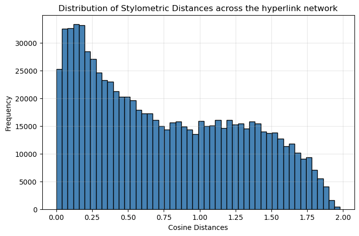
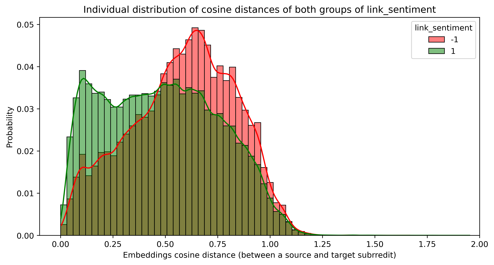
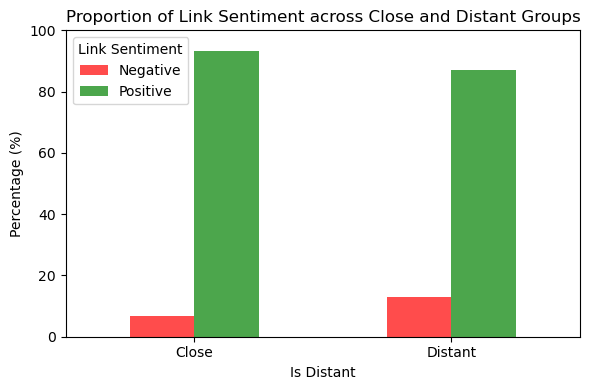
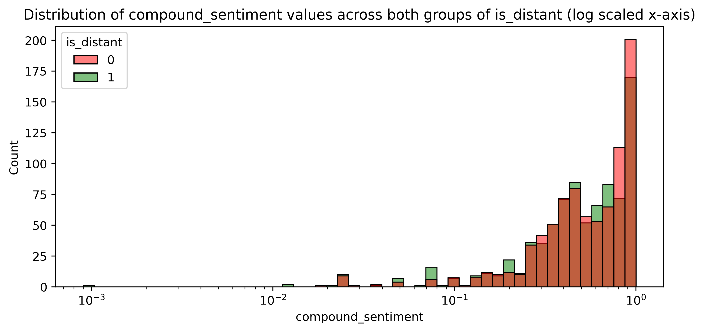
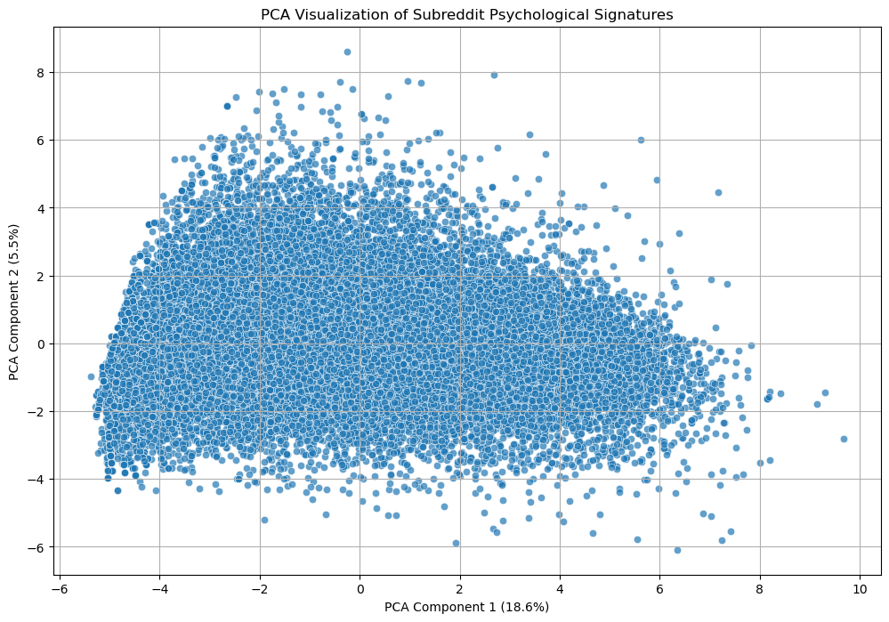
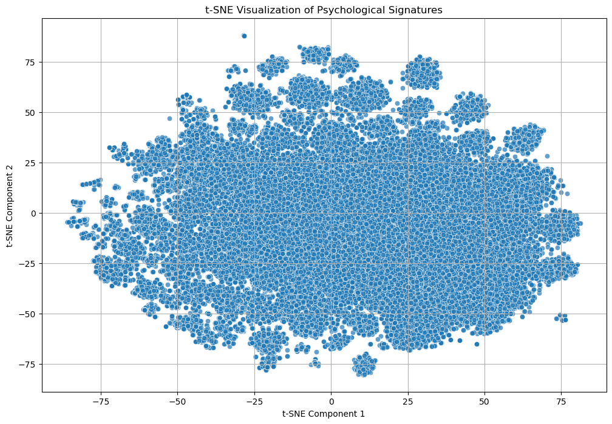

# <span style="color:#ff201e">Birds of a Feather… Fight Together?</span>
### Exploring How Similarity Shapes Conflict in Reddit’s Ecosystem

We often imagine online conflict as something that emerges between groups that share nothing in common : political opposites, rival fandoms, ideological extremes.

But what if this intuition is wrong?<br>
What if the most intense disputes don’t arise between opposites…  
but between communities that look almost exactly the <strong>same</strong>?

Reddit, with its tens of thousands of micro-communities, called subreddits, and millions of cross-subreddit references, offers the opportunity to explore this paradox. Communities cite one another, sometimes to praise, often to mock, and occasionally to even escalate into cultural wars.

Hidden inside these hyperlinks is a wealth of linguistic and psychological information:

- how people <strong>write</strong>
- how they <strong>feel</strong>
- how communities <strong>relate</strong> to one another

This leads us to a provocative set of questions:

<strong>Does similarity create harmony… or fuel conflict?</strong>

And more specifically:

<em>What does “similarity” even mean?</em><br>
Shared users? Writing style? Emotional tone?

<em>Do subreddits within the same thematic universe behave alike?</em>

<em>Is there a type of similarity so fundamental that it predicts whether an inter-community interaction will be positive or hostile?</em>

To investigate this, we rely on two large datasets from Stanford:

- <strong>850,000 inter-subreddit hyperlinks</strong> enriched with stylometric and psychological attributes  
- <strong>300-dimensional subreddit embeddings</strong> capturing patterns of shared authorship

These datasets allow us to view Reddit not as a collection of disconnected topics,  
but as a dynamic ecosystem of <strong>mindsets</strong>, <strong>writing styles</strong>, and <strong>shared populations</strong>.

In this data story, we map out what it means for two communities to be “similar”, examine how similarity relates to negativity, and ask:

<strong>Do birds of a feather flock together, or do they fight?</strong>


## <span style="color:#ff201e">A Map of Reddit’s Interactions</span>

Before we can understand why communities clash, we must first understand **how they resemble one another**.  
On Reddit, similarity is not a single dimension. It is an intricate mix of **who posts where**, **how people write**, and **what psychological traits they express**.  

To capture this, we introduce **three notions of similarity**, each one giving rise to a corresponding **distance** between subreddits:

1. **Shared Authorship Distance**  
2. **Stylometric Distance**  
3. **Psychological Distance**

Together, these distances serve as a springboard to define communities can be close, aligned, or fundamentally opposed.

## 1. Shared Authorship

Every subreddit has a “population signature”: a set of users who post there.  
The Stanford embeddings dataset compresses this information into a **300-dimensional vector** for each community.  
Two subreddits are close in this space **when many of the same users interact with both**.

Mathematically, we compare two communities using **cosine similarity**:

`cosine_sim(A, B) = (A · B) / (‖A‖ × ‖B‖)`

To turn similarity into a distance, we use:

**Shared Authorship Distance = 1 − cosine_sim(A, B)**

- **0** → communities whose authorship overlaps
- **2** → communities with no shared authorship

---

## 2. Stylometric Signatures: How Communities Write

Communities also differ in how they **sound** : their structure, complexity, and textual habits.

To capture a community’s writing style, we compute a **stylometric signature**, a vector built from features such as:

- average character count  
- fraction of uppercase letters  
- number of unique stopwords  
- average characters per sentence  
- automated readability index  

Because these features vary wildly in scale, we first apply **Z-score normalization**:

`(x − μ) / σ`

This ensures that no single feature dominates simply because it has larger numerical values.

Once each subreddit has its stylometric signature, we again compare communities via **cosine similarity**, not Euclidean distance, because we want to measure **proportions**, not magnitudes.

The resulting distance is:

`Stylometric Distance = 1 − cosine_sim(style_A, style_B)`

---

## 3. Psychological Signatures: What Communities Express

Language also reveals psychology.  
Each hyperlink post in the dataset includes **64 LIWC features** and **VADER sentiment scores**. LIWC is a text analysis program that counts words belonging to psychologically meaningful categories. Meanwhile, VADER (Valence Aware Dictionary and Sentiment Reasoner) is a rule-based sentiment analysis tool. It uses a specialized dictionary designed to accurately understand the emotions and opinions found in social media texts.

For each subreddit, we aggregate the normalized LIWC+VADER features of all its outgoing posts to define a **psychological signature**, the average emotional and cognitive expression shown by its authors when interacting with other communities.

As before, similarity is computed as a distance, using cosine similarity:

`Psychological Distance = 1 − cosine_sim(psych_A, psych_B)`

This gives us a final observation angle:  
**how similar communities are in what they feel and the emotions they display**.

---

## <span style="color:#ff201e">Exploring the Geometry of Similarity</span>

Before linking similarity to conflict, we first examine how each distance is distributed across Reddit.  
These distributions reveal the shape of each similarity space and provide intuition for how communities are built.

---

## Distribution of Distances

### **Shared Authorship Distance**

<p align="center">
  
  <br>
  <em>Figure : Distribution of shared authorship distances between subreddit pairs.</em>
</p>
 
The right-skewed distribution indicates that subreddits tend to be **moderately aligned** in structural space: they share enough authorship to be related, but rarely enough to be almost identical.  
Only a small fraction of pairs reach very high distances, meaning interactions between structurally opposite communities are uncommon.

---

### **Stylometric Distance**

<p align="center">
  
  <br>
  <em>Figure : Distribution of stylometric distances between subreddit pairs.</em>
</p>

In contrast to the embeddings distribution, stylometric distances are typically **lower**.  
This means that the **writing styles** used in cross-subreddit interactions often share structural similarities.

This suggests that users often have matching textual habits when dicussing across communities: sentence length, stopword diversity, or readability levels indicate a stylistic resemblance.

---

### **Psychological Distance**

<p align="center">
  
  <br>
  <em>Figure : Distribution of psychological distances between subreddit pairs.</em>
</p>

The psychological distance distribution centers around **moderate values**, indicating that most interactions occur between subreddits whose emotional and cognitive signatures are neither identical nor opposed.

Since these signatures are derived from **LIWC** and **VADER**, this pattern suggests that users interacting between different subreddits tend to display **loosely similar psychological traits**.

---

#### <span style="color:#ff201e">Embedding Distance & Link Sentiment</span>

We first look at how subreddit embedding distances relate to the sentiment of the hyperlinks they exchange.<br>
Roughly **10% of all links** in the dataset are negative, enough to notice patterns without depicting Reddit as a civil war.

**Are positive and negative links present at different distances?**
<div style="text-align:center;"> <p style="max-width:70%; margin:auto;">  <br> <em>Distribution of cosine distances for positive vs. negative links.</em> </p> </div>

Yes. Subreddit pairs with **negative** link sentiment have noticeably **larger cosine distances** than those with positive links.

This suggests that aligned communities tend to get along more (shocking, we know !), while more distant ones are more likely to disagree.

Positive links show a small bump near cosine distance **~0.1**, while negative links spike around **~0.6**.

The curves cross around <strong>0.5</strong>, below that, positive links dominate; above that, negative links take over.

---

<span style="color:#ff201e">Are the Means Actually Different?</span>

To double-check, we compared the mean cosine distances of the two sentiment groups.

A two-sample t-test (α = 0.05) confirms it:

**p ≤ 0.05**, so we reject the null hypothesis.

Communities with positive links are, on average, **closer** in embedding space than those with negative links.
Not a huge surprise ! but good to have statistical confirmation rather than intuition alone.

---

<span style="color:#ff201e">Correlation: How Strong Is the Relationship?</span>

We use a <strong>point-biserial correlation</strong>, since the distance is continuous and sentiment is binary.<br>
The result:
<ul> <li><strong>r ≈ -0.11</strong></li> <li><strong>p &lt; 0.05</strong></li> </ul>
So yes, the relationship is statistically significant, but the linear effect is <strong>very weak</strong>.<br>
A reasonable interpretation: embedding distance influences sentiment slightly, but it is far from the main factor.

---

### <span style="color:#ff201e">Causal Analysis: Does Distance Cause Negativity?</span>

To test whether being “far apart” in embedding space actually changes the sentiment of links, we frame distance as a treatment.

<ul> <li> <b>Binarizing distance</b><br> 
There is no natural cutoff in the cosine-distance distribution, so we split at the <b>median</b> : convenient and balanced (with the usual loss of granularity). 

</li> <li> <b>Visualizing Close vs. Distant Groups</b><br> 

<div style="text-align:center;"> <p style="max-width:55%; margin:auto;">  

<em>Proportion of positive/negative links in Close vs. Distant groups.</em> </p> </div> Before controlling for confounders, the <b>Distant<b> group has about <b>twice as many negative links</b> as the Close group.

A promising signal, but we need to check whether something else might be driving the effect. </li> <li> <b>Controlling for Confounders</b><br> We fit a logistic regression to estimate a <b>propensity score</b> using the hyperlink feature vector.<br> One covariate stands out: <b>compound_sentiment</b>, which correlates with both distance and link sentiment.<br> To handle it properly, we match pairs with a caliper of <code>0.2 × std</code> of that feature. <div style="text-align:center;"> <p style="max-width:55%; margin:auto;">  <br> <em>Distribution of compound_sentiment after matching. Balance achieved.</em> </p> </div> Matching rebalances the covariate well — so we can now measure the treatment effect clearly. </li> <li> <b>ATE: The Final Verdict</b><br> We compute the <b>Average Treatment Effect</b> (difference in mean link sentiment between the treated and control groups) and run a t-test. <ul> <li><b>p &gt; 0.05</b></li> <li>→ We <b>cannot reject</b> the null hypothesis.</li> </ul> After controlling for confounders, we do not find evidence that embedding distance <em>causes</em> changes in link sentiment.

It correlates, yes.

It differs across groups, yes. But causally?

Not shown — at least with this setup. </li> </ul>

## <span style="color:#ff201e">Visualizing the Psychological Space</span>

To better understand how signatures relate across communities, we can visualize the high-dimensional psychological space into two dimensions.  
We present both **PCA** (linear structure) and **t-SNE** (local non-linear structure).
PCA identifies the 2D projection plane that captures the maximum possible variance from the psychological features. On the other hand, t-SNE is a tool that reveals local structures and potential clusters by creating a 2D map that preserves the neighborhood relationships from the original high-dimensional space. We use it here to see if the psychological profiles form distinct groups.

<div style="display:flex; justify-content:center; gap:20px; flex-wrap:wrap;">

  <p align="center" style="max-width:45%;">
    
    <br>
    <em>PCA projection of psychological distances.</em>
  </p>

  <p align="center" style="max-width:45%;">
    
    <br>
    <em>t-SNE projection of psychological distances.</em>
  </p>

</div>

---

### **What does it all mean ?**

#### **PCA**
The first two principal components explain **24.07%** of the total variance. As the original data is of high dimension, this value is not inherently bad to grasp to main tendency.
The resulting projection forms a **dense, continuous cloud** without sharp separations, suggesting that subreddits vary smoothly in their psychological tone.  

#### **t-SNE**
While t-SNE also reveals a large central mass, it uncovers **peripheral clusters**. 
These clusters reflect **locally cohesive psychological communities**, even though the global landscape remains continuous.

These insights set the context a deeper question:  
**How does similarity in each space relate to negativity in cross-subreddit interactions?**


# <span style="color: #ff201e">Quick.</span> The fastest and easiest way to&nbsp;create a&nbsp;GitHub Pages website for your project.
#### The Quick theme magically transforms your `README.md` into a GitHub Pages site, applying clean and visually appealing styles.

<p class="ignore">Just see it yourself&thinsp;—&thinsp;<a href="https://devich.github.io/quick/">this page</a> is the same <code>README.md</code> file you’re reading, but with the Quick theme applied:</p>

<a class="ignore" href="https://devich.github.io/quick/"></a>

## Quick start

1. Make sure a `README.md` file exists in the root directory of your repo, and GitHub Pages is enabled in your repository settings.

2. Create a file named `_config.yml` in the root directory of your repository. The file should contain the following content:
```yaml
remote_theme: devich/quick@0.0.1
```

3. That’s it! There is no step 3. You now have a GitHub Pages website that’s based on your `README.md` file. The changes will take effect some time after you commit and push your updates to the repository. Enjoy your new website!


## Looking for a simple landing page for your project? 

No problem! You’re not restricted to using `readme.md` as the index page of your site. Simply create a file named `index.md`, and this theme will use it as the home page. Feel free to create as many pages as you want and link them within your site.

For instance, if you need a home page and an ‘About’ page, create files named `index.md` and `about.md`. Inside the `index.md` file, you can link to your ‘About’ page like this:

```md
[About this project](about)
```


## Fine tuning
### Additional settings in _config.yml

You can set additional parameters for the site in the `_config.yml` file.

The following options are available:

- `lang:` sets the language of the site. E.g. `en-US`, `uk`, `pl`, `fr-CA` and so on. The default value is `en-US`.
- `bg_color:` sets the background color of your website. Can be `dark`, `light` or `auto`. The default value is `auto`.
- `theme_color:` sets the main accent color for buttons, links, etc. It can be <nobr><code class="highlighter-rouge" style="color:#c52f21">red</code>,</nobr> <nobr><code class="highlighter-rouge" style="color:#d92662">pink</code>,</nobr> <nobr><code class="highlighter-rouge" style="color:#c0208a">fuchsia</code>,</nobr> <nobr><code class="highlighter-rouge" style="color:#9136a3">purple</code>,</nobr> <nobr><code class="highlighter-rouge" style="color:#7540be">violet</code>,</nobr> <nobr><code class="highlighter-rouge" style="color:#524ed1">indigo</code>,</nobr> <nobr><code class="highlighter-rouge" style="color:#2060de">blue</code>,</nobr> <nobr><code class="highlighter-rouge" style="color:#0172ac">azure</code>,</nobr> <nobr><code class="highlighter-rouge" style="color:#047878">cyan</code>,</nobr> <nobr><code class="highlighter-rouge" style="color:#007a50">jade</code>,</nobr> <nobr><code class="highlighter-rouge" style="color:#398712">green</code>,</nobr> <nobr><code class="highlighter-rouge" style="color:#a5d601">lime</code>,</nobr> <nobr><code class="highlighter-rouge" style="color:#f2df0d">yellow</code>,</nobr> <nobr><code class="highlighter-rouge" style="color:#ffbf00">amber</code>,</nobr> <nobr><code class="highlighter-rouge" style="color:#ff9500">pumpkin</code>,</nobr> <nobr><code class="highlighter-rouge" style="color:#d24317">orange</code>,</nobr> <nobr><code class="highlighter-rouge" style="color:#ccc6b4">sand</code>,</nobr> <nobr><code class="highlighter-rouge" style="color:#ababab">grey</code>,</nobr> <nobr><code class="highlighter-rouge" style="color:#646b79">zinc</code> or <nobr><code class="highlighter-rouge" style="color:#525f7a">slate</code>.</nobr> The default value is <nobr><code class="highlighter-rouge" style="color:#0172ac">azure</code>.
- `title:` sets the title of the site. If not set, your repository name will be used.
- `description`: sets the meta description tag, which typically contains a concise, relevant summary of the page’s content.
- `keywords`: sets keywords for the page, separated with commas.
- `gtag`: sets your Google Analytics tag if needed (e.g. G-A1BCDEFGHI).

Alternatively, you can copy the contents of the `_config.yml` file from the [theme repository](https://github.com/devich/quick/blob/main/_config.yml) into your own `_config.yml` file. This will give you access to all available options at once.


### Ignoring

If there’s a block in the `README.md` file that you don’t want to display on the GitHub Pages site, you can format this block as HTML and assign the `class="ignore"` attribute to it.

<p class="ignore">
    This paragraph <a href="https://devich.github.io/quick/">will not be displayed</a>
    on the site because it has an <code>"ignore"</code> class.
</p>

```html
<p class="ignore">
    This paragraph <a href="https://devich.github.io/quick/">will not be
    displayed</a> on the site because it has an <code>"ignore"</code> class.
</p>
```


### More customization

If you need to use your own CSS styles, create a file `assets/css/custom.css` in your repository and add your styles to it.

For a custom favicon, just place your file in `PNG` format at `assets/img/favicon.png`.

For full control, clone this repository and modify the template as you need.
